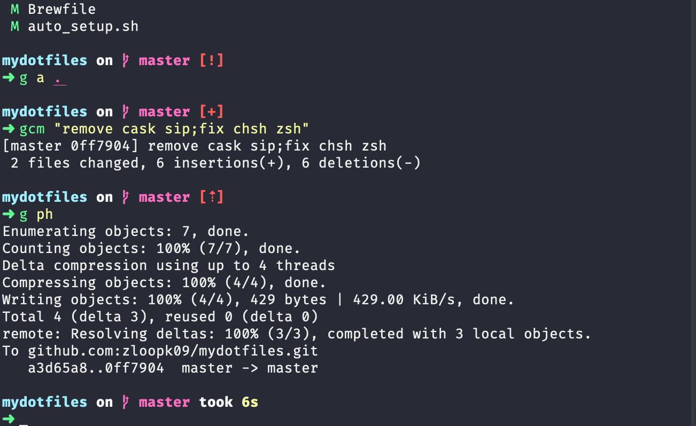
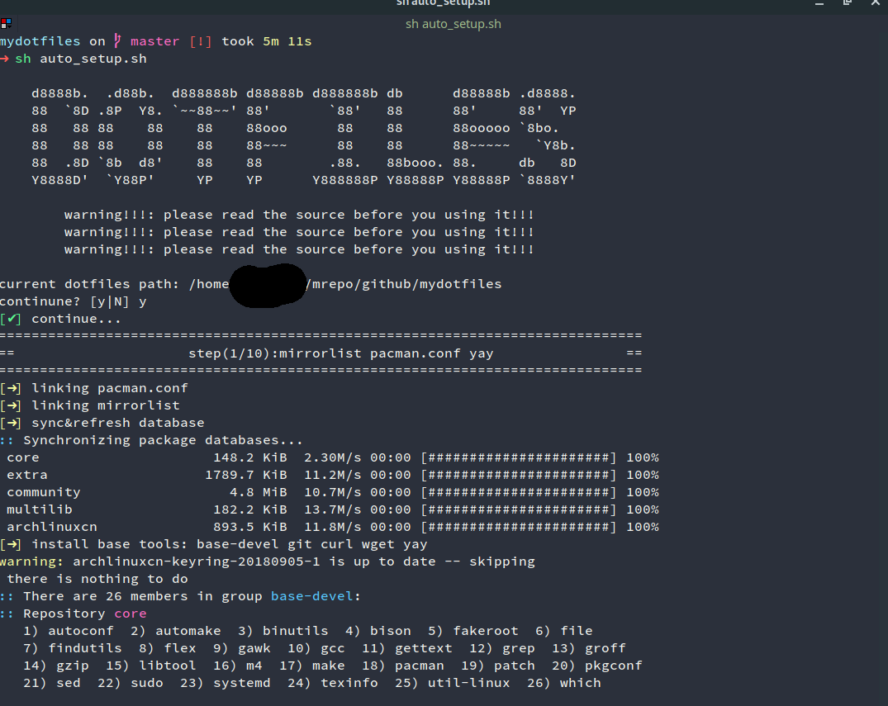
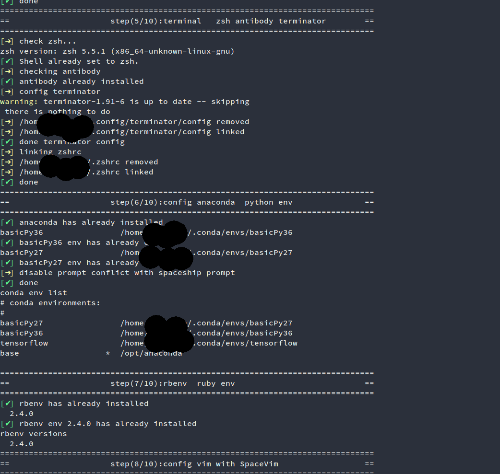

mydotfiles
-----------------

env: mac or manjaro(ArchLinux)

Reference
-----------------
- https://github.com/webpro/awesome-dotfiles
- https://dotfiles.github.io/

screenshots
-----------------
mac

manjaro

### todo
- vim config
- update preference.sh
- tmux config